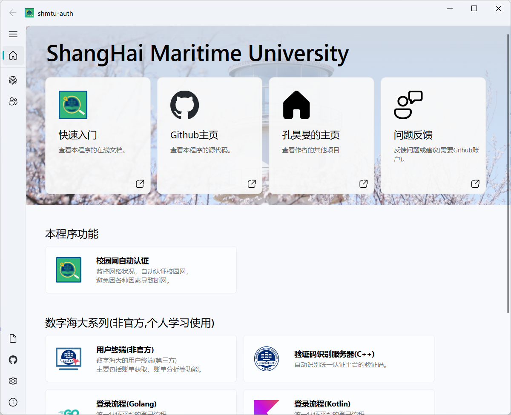

# 上海海事大学-校园网-自动认证

<!-- markdownlint-disable html -->

<div align="center" style="text-align: center;">


<div class="badges">


[![License](https://img.shields.io/github/license/a645162/shmtu-auth?label=license&logo=data:image/svg+xml;base64,PHN2ZyB4bWxucz0iaHR0cDovL3d3dy53My5vcmcvMjAwMC9zdmciIHZpZXdCb3g9IjAgMCAyNCAyNCIgd2lkdGg9IjI0IiBoZWlnaHQ9IjI0IiBmaWxsPSIjZmZmZmZmIj48cGF0aCBmaWxsLXJ1bGU9ImV2ZW5vZGQiIGQ9Ik0xMi43NSAyLjc1YS43NS43NSAwIDAwLTEuNSAwVjQuNUg5LjI3NmExLjc1IDEuNzUgMCAwMC0uOTg1LjMwM0w2LjU5NiA1Ljk1N0EuMjUuMjUgMCAwMTYuNDU1IDZIMi4zNTNhLjc1Ljc1IDAgMTAwIDEuNUgzLjkzTC41NjMgMTUuMThhLjc2Mi43NjIgMCAwMC4yMS44OGMuMDguMDY0LjE2MS4xMjUuMzA5LjIyMS4xODYuMTIxLjQ1Mi4yNzguNzkyLjQzMy42OC4zMTEgMS42NjIuNjIgMi44NzYuNjJhNi45MTkgNi45MTkgMCAwMDIuODc2LS42MmMuMzQtLjE1NS42MDYtLjMxMi43OTItLjQzMy4xNS0uMDk3LjIzLS4xNTguMzEtLjIyM2EuNzUuNzUgMCAwMC4yMDktLjg3OEw1LjU2OSA3LjVoLjg4NmMuMzUxIDAgLjY5NC0uMTA2Ljk4NC0uMzAzbDEuNjk2LTEuMTU0QS4yNS4yNSAwIDAxOS4yNzUgNmgxLjk3NXYxNC41SDYuNzYzYS43NS43NSAwIDAwMCAxLjVoMTAuNDc0YS43NS43NSAwIDAwMC0xLjVIMTIuNzVWNmgxLjk3NGMuMDUgMCAuMS4wMTUuMTQuMDQzbDEuNjk3IDEuMTU0Yy4yOS4xOTcuNjMzLjMwMy45ODQuMzAzaC44ODZsLTMuMzY4IDcuNjhhLjc1Ljc1IDAgMDAuMjMuODk2Yy4wMTIuMDA5IDAgMCAuMDAyIDBhMy4xNTQgMy4xNTQgMCAwMC4zMS4yMDZjLjE4NS4xMTIuNDUuMjU2Ljc5LjRhNy4zNDMgNy4zNDMgMCAwMDIuODU1LjU2OCA3LjM0MyA3LjM0MyAwIDAwMi44NTYtLjU2OWMuMzM4LS4xNDMuNjA0LS4yODcuNzktLjM5OWEzLjUgMy41IDAgMDAuMzEtLjIwNi43NS43NSAwIDAwLjIzLS44OTZMMjAuMDcgNy41aDEuNTc4YS43NS43NSAwIDAwMC0xLjVoLTQuMTAyYS4yNS4yNSAwIDAxLS4xNC0uMDQzbC0xLjY5Ny0xLjE1NGExLjc1IDEuNzUgMCAwMC0uOTg0LS4zMDNIMTIuNzVWMi43NXpNMi4xOTMgMTUuMTk4YTUuNDE4IDUuNDE4IDAgMDAyLjU1Ny42MzUgNS40MTggNS40MTggMCAwMDIuNTU3LS42MzVMNC43NSA5LjM2OGwtMi41NTcgNS44M3ptMTQuNTEtLjAyNGMuMDgyLjA0LjE3NC4wODMuMjc1LjEyNi41My4yMjMgMS4zMDUuNDUgMi4yNzIuNDVhNS44NDYgNS44NDYgMCAwMDIuNTQ3LS41NzZMMTkuMjUgOS4zNjdsLTIuNTQ3IDUuODA3eiI+PC9wYXRoPjwvc3ZnPgo=)](#license)

</div>

<div class="build-status">

</div>

</div>



## 使用文档

请参考
[使用文档](https://a645162.github.io/shmtu-auth/)

## 支持平台

- Windows命令行(exe、pip)
- macOS命令行(二进制文件、pip)
- Linux命令行(pip)
- Docker镜像

GUI Coming Soon...

## Features

- [x] 自动认证
- [x] 程序记录日志

## 使用方法

### 直接使用二进制可执行文件(推荐)

### Docker(推荐在服务器中使用这种方式)

[https://hub.docker.com/r/a645162/shmtu-auth](https://hub.docker.com/r/a645162/shmtu-auth)

```bash
docker pull registry.cn-shanghai.aliyuncs.com/a645162/shmtu-auth:latest
```

### 直接运行Python源代码(请手动安装依赖库)

#### Windows

```powershell
.\start.ps1
```

#### Linux

```bash
chmod +x start.sh
./start.sh
```

## 环境变量

**必选配置项：**

学号列表中，学号之间用`;`分隔

- `SHMTU_AUTH_USER_LIST` : {学号1};{学号2}
- `SHMTU_AUTH_USER_PWD_{学号1}` : {学号1的密码}
- `SHMTU_AUTH_USER_PWD_{学号2}` : {学号2的密码}
- `SHMTU_AUTH_USER_PWD_ENCRYPT_{学号1}` : {学号1的密码的是否为密文，密文为1，否则不用填}

**可选配置项：**

- `SHMTU_MACHINE_NAME`: 服务器名称
- `SHMTU_AUTH_TIME_INTERVAL`: 认证状态检测时间间隔
<!-- - `SHMTU_AUTH_WEBHOOK_WEWORK`: 企业微信机器人WebHook -->
<!-- - `SHMTU_WEBHOOK_SLEEP_TIME_START`: WebHook免打扰-开始时间 -->
<!-- - `SHMTU_WEBHOOK_SLEEP_TIME_END`: WebHook免打扰-结束时间 -->

## 开发指南

推荐使用`uv`进行包管理，也可以使用`Anaconda`或`Miniconda`创建虚拟环境。
推荐使用学生认证的`Jetbrains PyCharm Professional`进行开发。

因为许多开发步骤已经在`PyCharm`中配置好，因此推荐使用`PyCharm`进行开发。

## GUI说明

Windows下AMD显卡显示Mica云母特效会有问题，因此全局关闭了Mica云母特效。

macOS x64下Python版本必须小于等于3.11，否则无法安装PySide6。

## License

本程序使用[GPL-3.0](https://www.gnu.org/licenses/gpl-3.0.html)协议开源。

GPLv3协议是我非常喜欢的一个协议，我的大部分程序均基于GPLv3协议开源。

此外，本程序使用到的QFluentWidgets库恰好也是基于GPLv3协议开源的。
